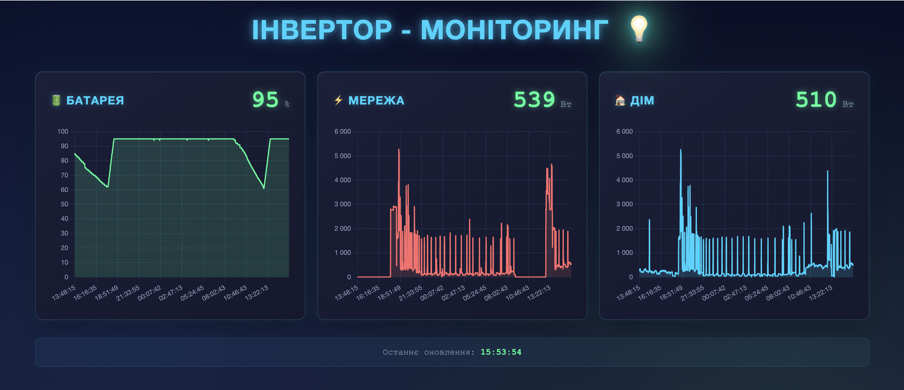

# Бойлер-контролер 🔋💡

Автоматична система керування бойлером на основі стану сонячної батареї та мережі електропостачання.

## Опис

Цей проект автоматично керує бойлером через розумну розетку Xiaomi, базуючись на:
- Стані батареї сонячної системи (інвертор Deye)
- Наявності мережі електропостачання
- Навантаженні дому

Система вмикає бойлер тільки коли:
- ✅ Є мережа електропостачання
- ✅ Батарея заряджена на 95% або більше
- ✅ Навантаження дому не перевищує 2000 Вт

Бойлер автоматично вимикається коли:
- ❌ Немає мережі
- ❌ Навантаження дому перевищує 4000 Вт

## Вимоги

- Python 3.12+
- Інвертор Deye з підтримкою Modbus TCP
- Розумна розетка Xiaomi (ChuangmiPlug)
- Доступ до локальної мережі з обома пристроями

## Встановлення

### 0.
скачати актуальну версію файлу **token_extractor.py** 

```bash
curl -L -o token_extractor.py https://raw.githubusercontent.com/PiotrMachowski/Xiaomi-cloud-tokens-extractor/master/token_extractor.py
```

### 1. Клонування репозиторію

```bash
git clone <repository-url>
cd boiller
```

### 2. Встановлення 

```bash
docker compose build check
```

### 3. Налаштування конфігурації

Створіть файл `config.json` на основі прикладу:

```json
{
    "deye": {
        "ip": "192.168.1.2",
        "serial": 9999999999
    },
    "mijia": {
        "ip": "192.168.1.3",
        "token": "your_token_here"
    }
}
```

**Отримання token для Xiaomi:**

### 4. Налаштування параметрів

У файлі `boiller.py` можна змінити порогові значення:

```python
SOC_LEVEL = 95          # Мінімальний рівень заряду батареї для вмикання бойлера (%)
HOME_LOAD = 2000        # Максимальне навантаження дому для вмикання бойлера (Вт)
MAX_HOME_LOAD = 4000    # Максимальне навантаження дому перед вимиканням (Вт)
```

## Використання

Використайте:

```bash
docker compose run --rm token
```

### Запуск як systemd сервіс

1. Скопіюйте `boiller.service` до `/etc/systemd/system/`:

```bash
sudo cp boiller.service /etc/systemd/system/
```

2. Відредагуйте шлях у файлі сервісу (рядок `WorkingDirectory`)

3. Запустіть сервіс:

```bash
sudo systemctl daemon-reload
sudo systemctl enable boiller.service
sudo systemctl start boiller.service
```

4. Перевірте статус:

```bash
sudo systemctl status boiller.service
```

5. Перегляд логів:

```bash
docker compose logs -f check
```

### Веб-інтерфейс з графіками



Система включає веб-інтерфейс для моніторингу даних у реальному часі.

1. Запустіть веб-сервер:

```bash
docker compose up -d web
```

2. Відкрийте браузер і перейдіть за адресою:

```
http://localhost:8080
```

Веб-інтерфейс відображає:
- 📊 Графіки значень `battery_soc`, `grid_load`, `home_load` у реальному часі
- 📈 Історію останніх 1000 записів (останні ~16 годин)
- 🔄 Автоматичне оновлення кожні 60 секунд
- 📱 Адаптивний дизайн для мобільних пристроїв

Дані зберігаються в файлі `data_history.json` і автоматично оновлюються при кожній перевірці.

## Логування

Система виводить інформацію про кожну перевірку:
- 🕯️ Мережі немає - бойлер вимкнено
- 💡 Мережа є, батарея заряджена - бойлер увімкнено
- ⏳ Мережа є, чекаємо зарядження батареї
- ❌ Помилки під час роботи

Перевірка відбувається кожні 60 секунд.

## Структура проекту

```
boiller/
├── boiller.py           # Основний скрипт керування
├── web_server.py        # Веб-сервер з API та графіками
├── data_storage.py     # Модуль зберігання історії даних
├── templates/
│   └── index.html      # Веб-інтерфейс з графіками
├── data_history.json   # Історія даних (створюється автоматично)
├── config.json         # Конфігурація (не включено в git)
├── token_extractor.py  # Утиліта для отримання token Xiaomi
├── Dockerfile          # Docker образ
├── docker-compose.yml  # Docker Compose конфігурація
├── boiller.service     # Systemd сервіс
└── README.md           # Документація
```


## Автор

[odykusha]
